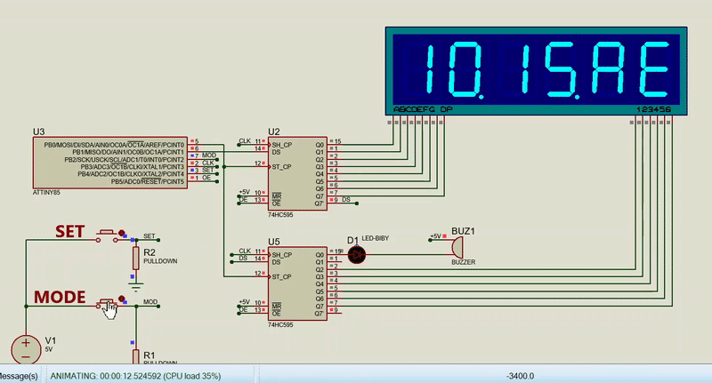
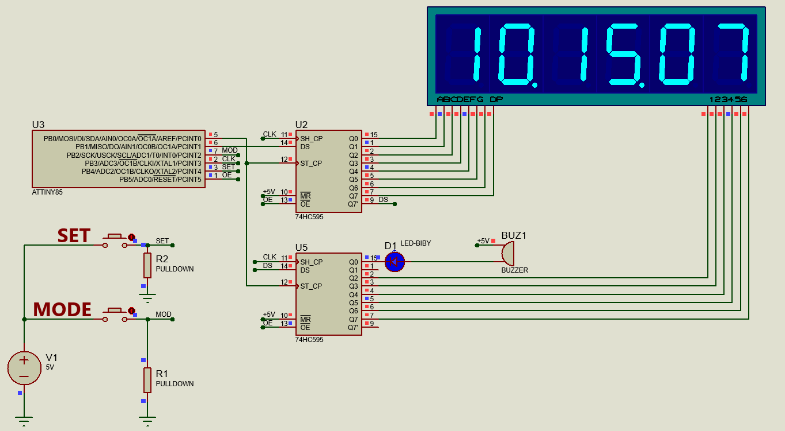

# A digital clock with calendar & alarm using the ATTiny85

This is a fun project that I did. The accuracy of the clock over time is understandably low since I'm just using the internal oscillator of the ATTiny85.

This app is designed to work with a 6-digit, 7-segment display and due to the number of pins needed, uses two 74HC595 8-bit shift registers. There are two buttons ```MODE``` and ```SET``` to switch between the time, calendar and alarm screen and to set the time and alarm.

# Usage

- The clock app has three screens - ``Time``, ``Calendar`` and ``Alarm`` which can be cycled by pressing the ```MODE``` button.
- Once you are at any given screen and need to modify the values, press and hold the ```MODE``` button for approximately 3 seconds to enter the ```Edit Mode```.
- Once you are in ```Edit Mode``` you can use the ```SET``` button to change the active blinking digit.
- Pressing ```MODE``` when in ```Edit Mode``` allows you to toggle between the digits.
- To exit ```Edit Mode```, press and hold the ```MODE``` button again for 3 seconds to exit ```Edit Mode``` and enter the normal mode.
- The above applies to each of the three screens, including the alarm, for which the third screen allows you to set the alarm time and whether the alarm is enabled or disabled using the ```AE``` or ```Ad``` flag respectively.

>Note: The date is displayed in DD-MM-YY and the time in 24-hour formats.

# Proteus Simulation

- Use the [Proteus](https://www.labcenter.com/simulation/) file to simulate what has been described without using actual hardware.


# Demo 


# Pre-requisties to compile and flash the program to MCU

# Windows
## Compiler
- Download and extract [AVR GNU Toolchain ](https://www.microchip.com/mplab/avr-support/avr-and-arm-toolchains-c-compilers) for Windows and add the `bin` directory to `PATH` Windows Environment variable.

## Flash Tools
- Download and extract [avrdude](http://download.savannah.gnu.org/releases/avrdude/avrdude-6.3-mingw32.zip) to any location on your PC. Add the folder to Windows Environment variable `PATH`.

    (or)
- You can also use the [Micronucleus](https://github.com/micronucleus/micronucleus) bootloader. Download and add the folder ```commandline``` to ```path``` as before.

# Debian/Ubuntu Linux
## Compiler and Flash tools installation
- For Linux, follow the instructions available on this [repository](https://github.com/jabezwinston/AVR8_sample_programs).

# Compilation
- Use the following command to compile and create the HEX file in folder `build`
    ```
    make all
    ```
- Alternatively, Atmel Studio 7 project files are available.

### Flashing to MCU

- Use ```make flashUSBasp``` to dump the created HEX file into your MCU. Script in `Makefile` uses `avrdude` and `USBasp`.

- If you are using Micronucleus, use ```make flashMicronucleus``` to do the same.

# Circuit


